# Konsole Analyzer

Application web qui analyse un site d'entreprise et génère une fiche enrichie :
nom, logo, secteur, taille, tech stack, signaux GTM et score de pertinence commerciale (0–100).

Projet réalisé dans le cadre du processus de recrutement chez **<a href="https://youno.fr" target="_blank">Youno</a>** par **Claire Naudin**, développeuse.

À l'issue du test technique, j'ai continué à utiliser cet outil comme outil métier personnel — il me permet de mieux identifier les entreprises les plus adaptées à mon profil avant d'envoyer une candidature.

> **Merci à l'équipe <a href="https://youno.fr" target="_blank">Youno</a>** pour leur autorisation de publication de ce projet. 🙏

**Stack :** React · Vercel Serverless · Groq (LLaMA 3.1) · Clearbit · Vite · Jest · Vitest

---

## Démo

🔗 <a href="https://konsole-analyzer-gamma.vercel.app" target="_blank">konsole-analyzer-gamma.vercel.app</a>

---

## Sommaire

1. [Interface](#interface)
2. [Fonctionnement](#fonctionnement)
3. [Structure du projet](#structure-du-projet)
4. [Installation](#installation)
5. [Développement local](#développement-local)
6. [Tests](#tests)
7. [Scoring](#scoring)
8. [Déploiement](#déploiement)
9. [Sécurité](#sécurité)
10. [Choix techniques](#choix-techniques)
11. [Problèmes rencontrés](#problèmes-rencontrés)
12. [Limites connues](#limites-connues)
13. [Améliorations prioritaires](#améliorations-prioritaires-en-production)
14. [Organisation](#organisation)

---

## Interface

<div align="center">

### 🖥️ Desktop

<table>
  <tr>
    <td align="center">
      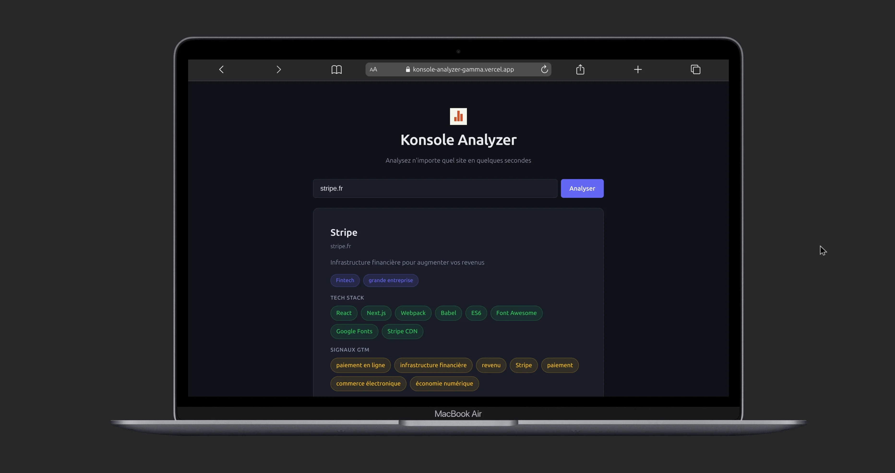
      <br/><em>Desktop - Interface</em>
    </td>
    <td align="center">
      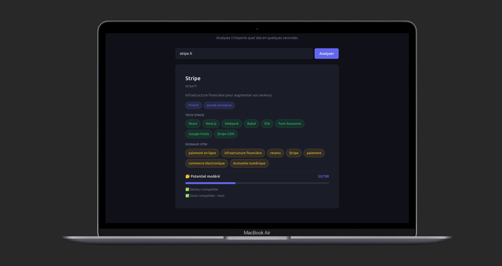
      <br/><em>Desktop - Interface2</em>
    </td>
  </tr>
</table>

### 📱 Mobile

<table>
  <tr>
    <td align="center">
      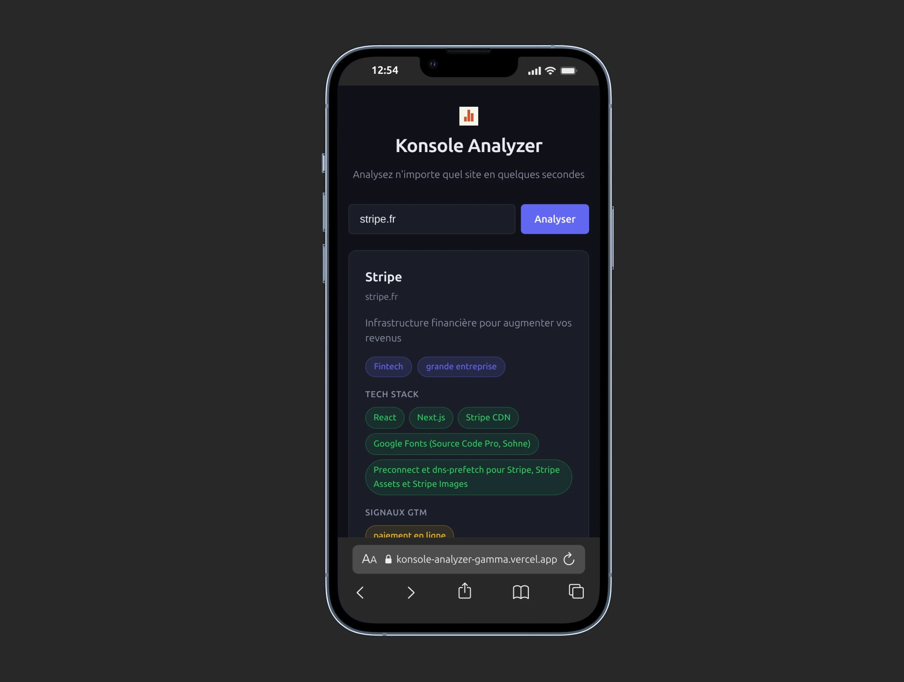
      <br/><em>Mobile - Interface</em>
    </td>
    <td align="center">
      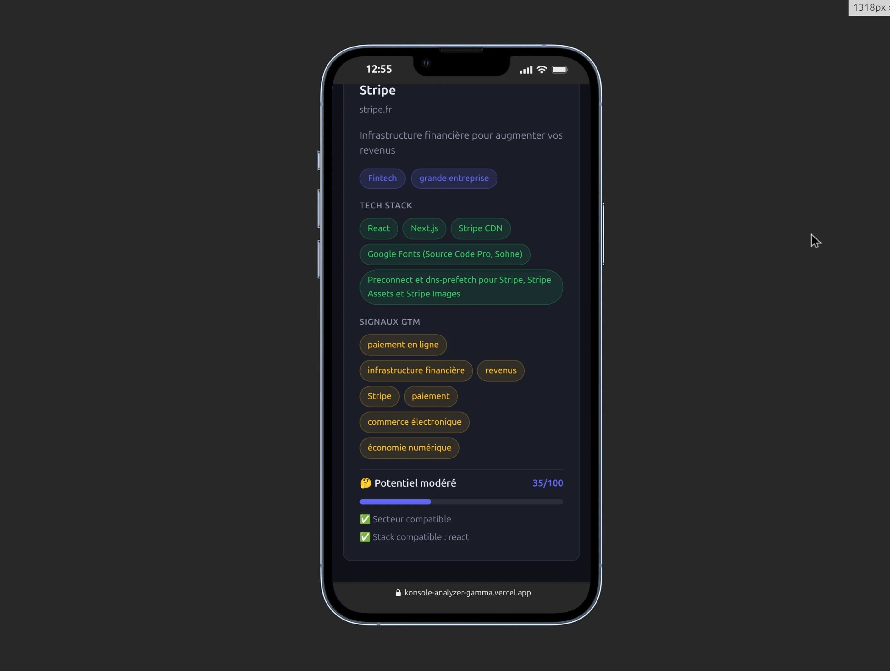
      <br/><em>Mobile - Interface2</em>
    </td>
  </tr>
</table>

</div>

---

## Fonctionnement

```

URL saisie → validation → scraping HTML → enrichissement Clearbit → analyse LLM Groq → scoring → fiche affichée

```

1. L'utilisateur saisit une URL (`youno.fr`, `stripe.com`…)
2. Le backend valide et normalise l'URL
3. Le HTML de la page est scrapé (head + début de body, 3 000 chars max)
4. Clearbit fournit le logo et le nom officiel
5. Groq (LLaMA 3.1 8B) extrait : secteur, taille, langue, tech stack, signaux GTM
6. Un score 0–100 est calculé selon 5 critères B2B
7. La fiche est affichée

---

## Structure du projet

```

konsole-analyzer/
│
├── api/
│ ├── analyze.js ← endpoint Vercel Serverless
│ └── package.json ← force CommonJS dans api/
│
├── functions/ ← modules backend + tests Jest
│ ├── src/
│ │ ├── validator.js
│ │ ├── scraper.js
│ │ ├── clearbit.js
│ │ ├── groq.js
│ │ ├── scoring.js
│ │ └── analyzer.js
│ └── **tests**/ ← 6 fichiers — 37 tests Jest
│
├── src/ ← frontend React
│ ├── components/
│ ├── hooks/
│ ├── utils/
│ ├── styles/ ← 9 fichiers CSS natif mobile-first
│ └── **tests**/ ← 8 fichiers — 29 tests Vitest
│
├── dist/
├── vercel.json
└── .env.local ← non commité

```

---

## Prérequis

- Node.js 18+
- npm 9+
- Compte Vercel (gratuit)
- Clé API Groq → <a href="https://console.groq.com" target="_blank">console.groq.com</a>

---

## Installation

```bash
git clone https://github.com/Poca23/konsole-analyzer.git
cd konsole-analyzer
npm install
cd functions && npm install && cd ..
```

Créer `.env.local` à la racine :

```
VITE_API_URL=https://konsole-analyzer-gamma.vercel.app
```

> Ne jamais committer ce fichier — protégé par `.gitignore`.

---

## Développement local

```bash
# Lancer le frontend
npm run dev

# Tester l'API en live
curl -X POST https://konsole-analyzer-gamma.vercel.app/analyze \
  -H "Content-Type: application/json" \
  -d '{"url": "youno.fr"}'
```

---

## Tests

### Résultats

| Outil             | Suites | Tests  |
| ----------------- | ------ | ------ |
| Jest — backend    | 6      | 37     |
| Vitest — frontend | 8      | 29     |
| **Total**         | **14** | **66** |

> Tous les tests sont écrits avant le code (TDD strict).

### Lancer les tests

```bash
# Backend (Jest)
cd functions && npx jest

# Frontend (Vitest)
npm run test
```

### Captures

<div align="center">

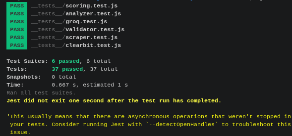
<br/><em>Tests Backend — 37 tests Jest verts (6 suites)</em>

<br/><br/>

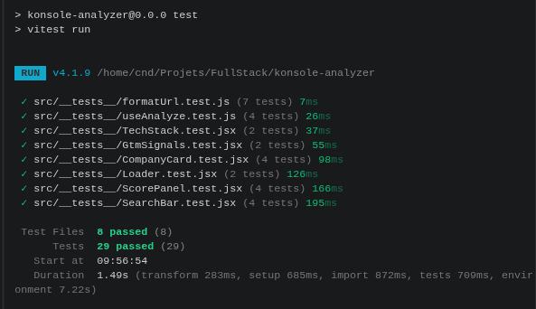
<br/><em>Tests Frontend — 29 tests Vitest verts (8 suites)</em>

</div>

---

## Tests live

| URL         | Nom     | Secteur | Taille            | Score            |
| ----------- | ------- | ------- | ----------------- | ---------------- |
| youno.fr    | Youno   | Agence  | startup           | 70–80/100        |
| stripe.com  | Stripe  | Fintech | grande entreprise | 40/100           |
| notion.so   | Notion  | SaaS    | grande entreprise | 85/100           |
| lemlist.com | lemlist | SaaS    | startup           | 100/100          |
| localhost   | —       | —       | —                 | Erreur propre ✅ |

<div align="center">

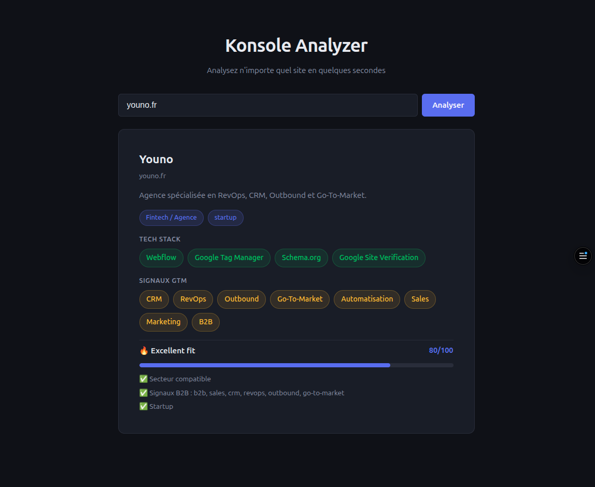
<br/><em>Analyze - youno.fr — Agence · startup · 70–80/100 🔥</em>

<br/><br/>

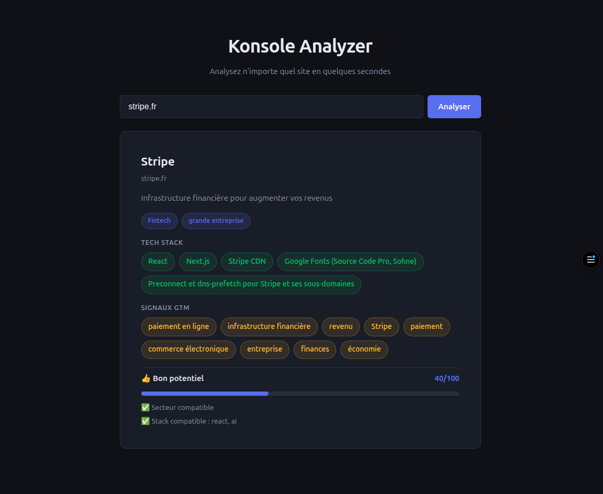
<br/><em>Analyze - stripe.com</em>

<br/><br/>

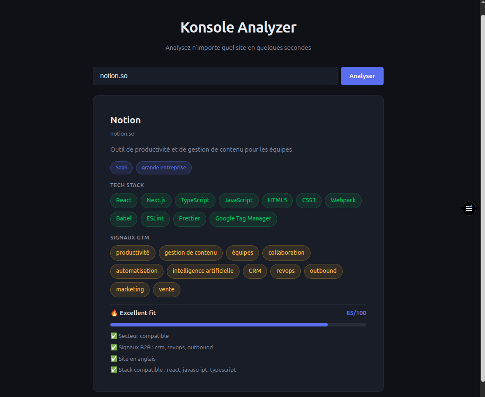
<br/><em>Analyze - notion.so</em>

<br/><br/>

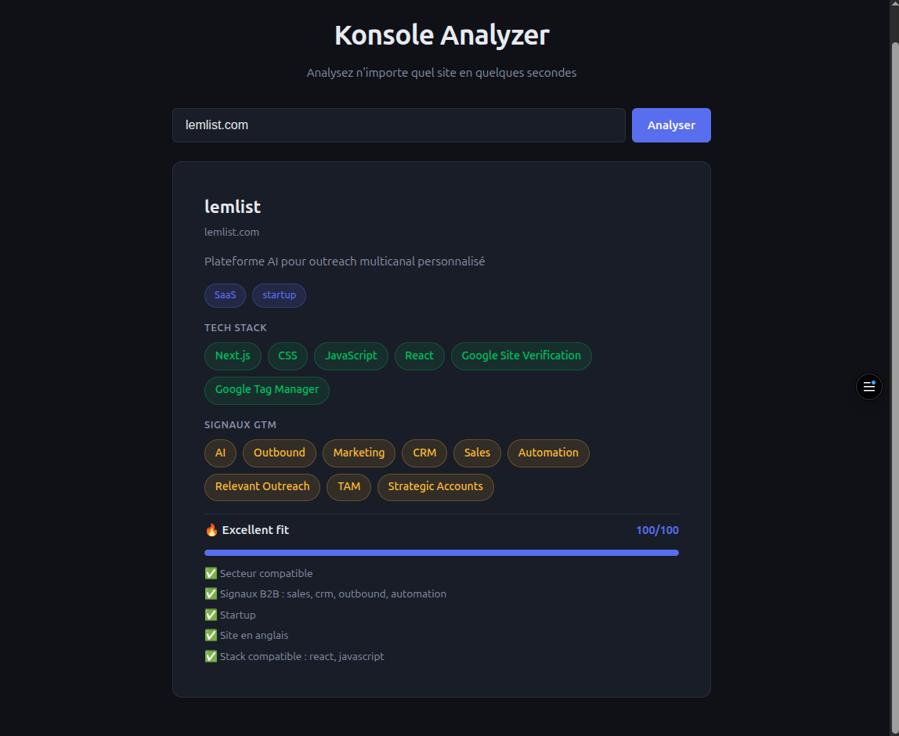
<br/><em>Analyze - lemlist.com</em>

<br/><br/>

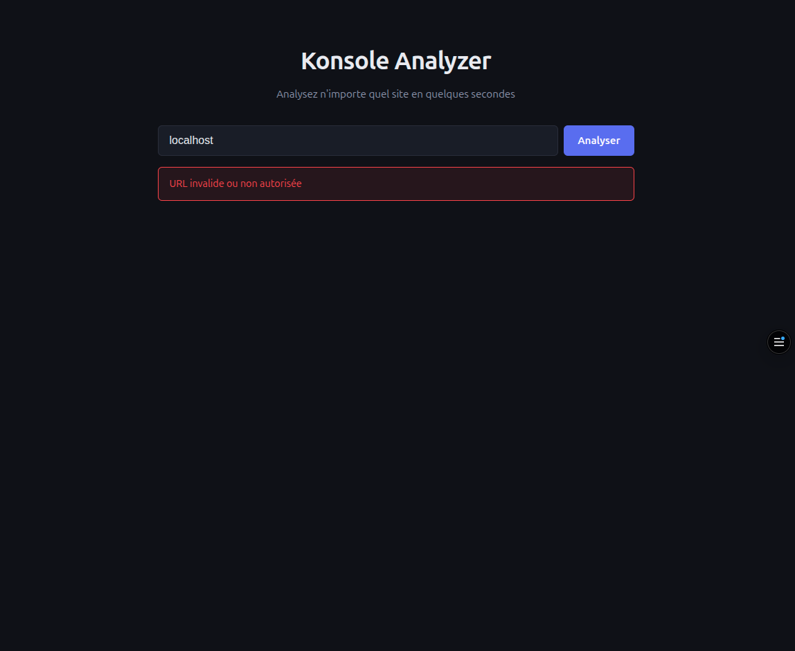
<br/><em>Analyze - localhost — URL bloquée, erreur gérée proprement</em>

</div>

---

## Scoring

| Critère         | Points max | Détail                                 |
| --------------- | ---------- | -------------------------------------- |
| Secteur tech    | 30         | SaaS, Fintech, Agence, Consulting…     |
| Signaux B2B     | 30         | b2b, saas, crm, revops, outbound, gtm… |
| Taille          | 20         | startup = 20, PME = 15                 |
| Langue anglaise | 10         | site en `en`                           |
| Stack tech      | 20         | React, Node, Docker… ← ajouté en v1.1  |

| Score | Label               |
| ----- | ------------------- |
| ≥ 70  | 🔥 Excellent fit    |
| ≥ 40  | 👍 Bon potentiel    |
| ≥ 20  | 🤔 Potentiel modéré |
| < 20  | ❄️ Peu pertinent    |

---

## Déploiement

Push sur `main` → déploiement automatique Vercel.

```bash
npm run build
git push origin main
```

<div align="center">

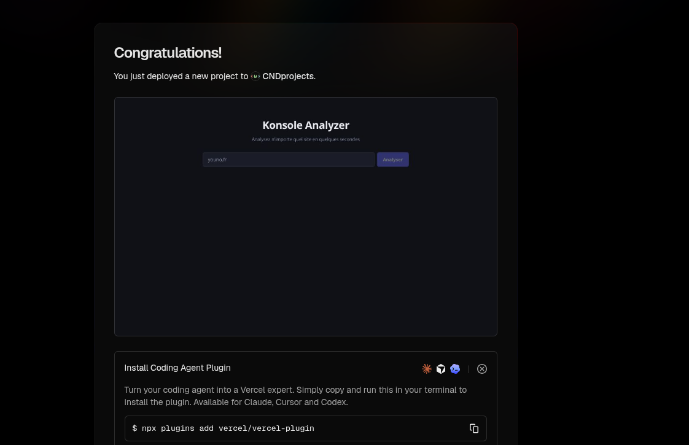
<br/><em>Premier déploiement du projet - Vercel</em>
<br/><br/>

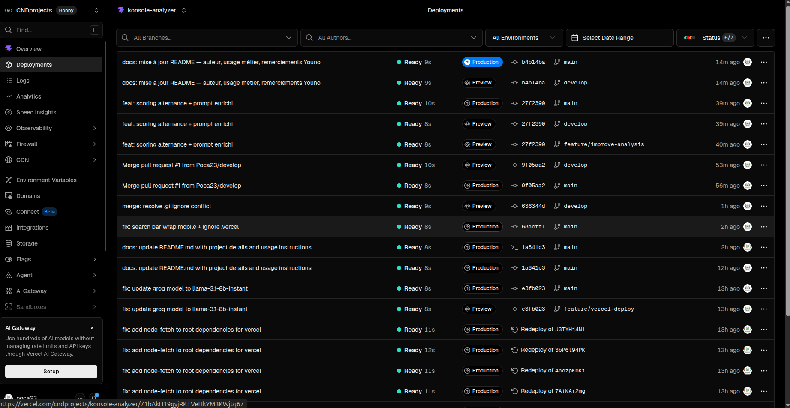
<br/><em>Historique des déploiements — chaque push sur main déclenche un build automatique</em>

</div>

---

## Sécurité

| Point                                | État                    |
| ------------------------------------ | ----------------------- |
| Clé Groq dans Vercel Dashboard       | ✅ jamais dans le code  |
| `.env.local` absent de GitHub        | ✅                      |
| CORS configuré dans `api/analyze.js` | ✅                      |
| Domaines locaux bloqués              | ✅ localhost, 127.0.0.1 |
| Validation + normalisation des URLs  | ✅                      |

---

## Choix techniques

| Choix                 | Raison                                                          |
| --------------------- | --------------------------------------------------------------- |
| Vercel Serverless     | Gratuit, sans carte bancaire, déploiement auto depuis GitHub    |
| Groq / LLaMA 3.1 8B   | Rapide, gratuit en dev, extraction structurée fiable            |
| Clearbit Autocomplete | API publique sans clé pour logo + nom                           |
| CSS natif             | Zéro dépendance, performances maximales, mobile-first           |
| Vitest                | Natif Vite, même config, pas de Jest séparé côté frontend       |
| TDD                   | Contrats définis avant le code — moins de bugs, refactoring sûr |

---

## Problèmes rencontrés

| Problème                                | Solution                                      |
| --------------------------------------- | --------------------------------------------- |
| Firebase exige carte bancaire (Blaze)   | Migration vers Vercel                         |
| Conflit CommonJS / ES Modules           | `api/package.json` avec `{"type":"commonjs"}` |
| `node-fetch` inaccessible depuis `api/` | `npm install node-fetch@2` à la racine        |
| Modèle `llama3-8b-8192` décommissionné  | Remplacement par `llama-3.1-8b-instant`       |
| `youno.fr` score trop bas (30/100)      | Ajout critère stack tech + listes élargies    |

---

## Limites connues

- Certains sites bloquent le scraping (Cloudflare, CAPTCHA) → fiche partielle
- Clearbit couvre principalement les entreprises anglophones connues
- Le score est basé sur des heuristiques, pas sur des données CRM réelles
- Pas d'authentification sur l'endpoint (usage interne assumé)

---

## Améliorations prioritaires en production

- Cache sur les domaines déjà analysés
- Score personnalisable selon le profil client cible de Konsole
- Historique des analyses par utilisateur
- Batch — analyser plusieurs URLs en une fois
- Webhook pour déclencher une analyse depuis un CRM

---

## Organisation

<div align="center">

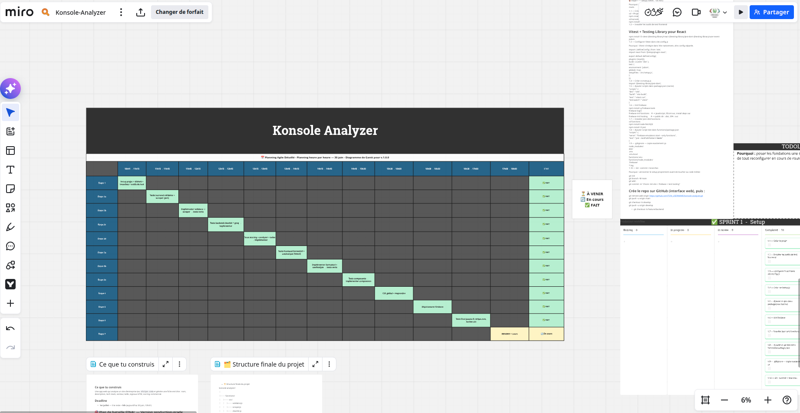
<br/><em>Planning agile sur Miro — découpage en étapes, suivi d'avancement</em>

<br/><br/>

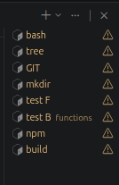
<br/><em>Terminal — développement et tests en local</em>

<br/><br/>

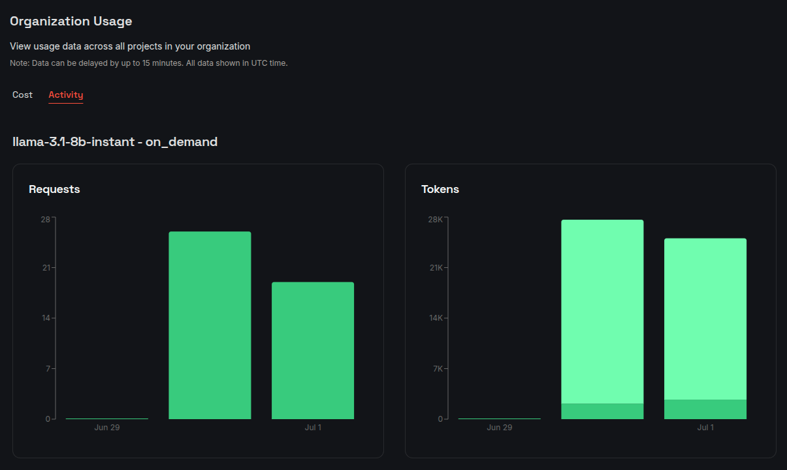
<br/><em>Groq Dashboard — suivi des requêtes et tokens consommés pendant le développement</em>

<br/><br/>

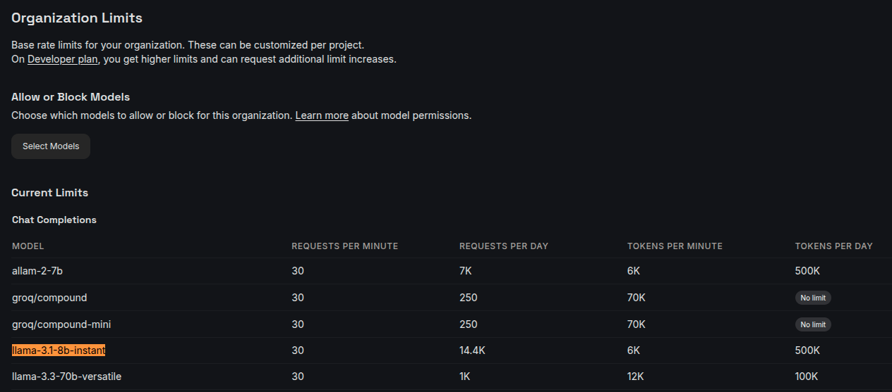
<br/><em>Groq — limites de rate du modèle llama-3.1-8b-instant utilisé en production</em>

</div>

---

## Auteur

**Claire Naudin** — Développeuse

🔗 <a href="https://portfolio-cnd.netlify.app" target="_blank">portfolio-cnd.netlify.app</a>

Projet réalisé dans le cadre du processus de recrutement chez <a href="https://youno.fr" target="_blank">Youno</a>, puis utilisé comme outil métier personnel pour identifier les entreprises les plus pertinentes lors de mes recherches d'emploi.

Merci à l'équipe <a href="https://youno.fr" target="_blank">Youno</a> pour leur autorisation de publication. 🙏
